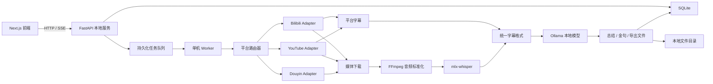
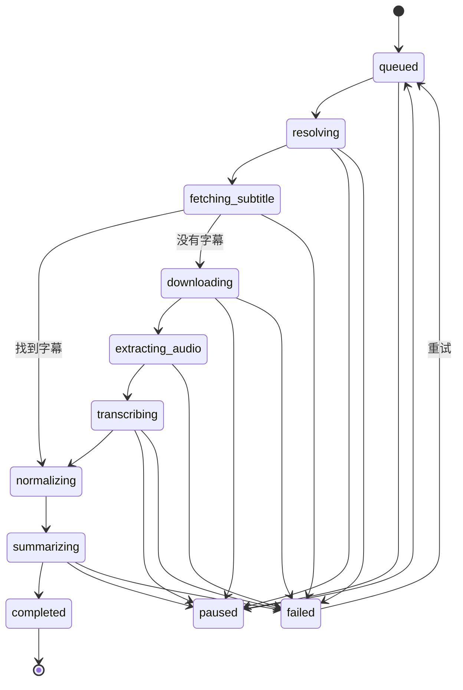

# 拾句：本地视频文案提取后端技术调研与方案设计

> 文档状态：后端技术调研 / MVP 设计  
> 编写日期：2026-06-07  
> 目标环境：MacBook Pro 16 英寸，Apple M3 Pro，36 GB 统一内存  
> 对应前端：Next.js 16，支持抖音、Bilibili、YouTube，单批 1-10 条链接

## 1. 文档目的

“拾句”的前端页面已经覆盖新建任务、处理进度、历史记录和文案详情。当前需要补齐一个可以在用户 Mac 本机运行的后端，使用户提交视频链接后，自动得到：

1. 带时间戳的视频逐字稿；
2. 结构化内容总结；
3. 精彩金句；
4. TXT、SRT、Markdown 等可导出结果。

本方案的核心约束是：

- 不调用付费字幕、语音识别或大模型 API；
- 视频、音频、字幕和生成结果默认只保存在本机；
- 使用开源软件和可本地运行的模型；
- 优先复用平台已有字幕，字幕不可用时才做本地语音识别；
- 允许用户离开页面，任务继续执行并可恢复；
- 下载器、字幕解析器和模型可以独立替换。

## 2. 结论摘要

推荐采用以下技术组合：

| 能力 | 推荐实现 | 作用 |
| --- | --- | --- |
| 本地后端 | Python + FastAPI | 提供任务、进度、结果和文件接口 |
| 持久化队列 | SQLite + 单机 Worker | 保证页面关闭或服务重启后任务仍可恢复 |
| 通用视频解析 | yt-dlp | 支持 YouTube、Bilibili、TikTok 等站点 |
| 抖音备用解析 | 独立 Douyin Adapter | 隔离抖音频繁变化的解析逻辑 |
| 音视频处理 | FFmpeg / ffprobe | 抽取单声道 16 kHz 音频、读取时长、分段 |
| Apple Silicon ASR | mlx-whisper | 使用 M3 Pro GPU/统一内存进行本地转写 |
| 本地内容整理 | Ollama + 中文指令模型 | 生成总结、金句和结构化 JSON |
| 可选画面文字 | macOS Vision 或 PaddleOCR | 识别没有被说出来的画面文字 |
| 进度推送 | SSE | 将任务状态实时推送给 Next.js 页面 |

推荐主流程：

```text
提交链接
  -> 识别平台、展开短链接
  -> 获取视频元数据
  -> 优先查找平台已有字幕
  -> 无字幕时下载音频
  -> FFmpeg 标准化音频
  -> mlx-whisper 本地转写
  -> 清洗并合并逐字稿
  -> Ollama 本地生成总结和金句
  -> SQLite 保存结果
  -> 前端查看、复制和导出
```

Apple M3 Pro + 36 GB 适合运行该方案。建议默认只运行 **1 个 ASR Worker**，下载并发设为 **2-3**。单批允许提交 10 条任务，但不应同时启动 10 个 Whisper 模型实例。

## 3. 产品边界

### 3.1 “完全免费”的准确含义

本方案不产生按次 API 费用，但仍有以下成本：

- 首次下载开源模型需要网络和磁盘空间；
- 从视频平台获取公开视频必须联网；
- 本地推理会消耗电量、CPU/GPU、内存和存储；
- 平台规则变化后需要维护下载适配器。

模型下载完成后，语音识别、总结和金句生成均可在断开网络的情况下处理本地媒体文件。

### 3.2 “无需登录”的准确含义

前端可以表达为“不需要注册拾句账号”，但不应承诺所有视频平台都不需要登录。

- 公开视频首先匿名解析；
- 年龄限制、地区限制、平台风控或登录可见内容可能需要平台 Cookie；
- Cookie 只能由用户主动开启，并从本机浏览器临时读取；
- 不上传 Cookie，不在日志中打印 Cookie，不默认导出明文 Cookie 文件；
- 私密、付费、已删除或无访问权限的视频不绕过限制。

建议前端将“无需登录 · 即开即用”调整为：

> 无需注册拾句账号 · 内容默认在本机处理

### 3.3 “文案”的三种来源

| 文案类型 | 获取方式 | 典型场景 |
| --- | --- | --- |
| 平台字幕 | 读取平台字幕文件 | Bilibili AI 字幕、YouTube 自动字幕 |
| 语音逐字稿 | Whisper 本地 ASR | 抖音口播、没有字幕的视频 |
| 画面文字 | 视频抽帧 + OCR | PPT、字幕贴纸、商品参数、未念出的标题 |

MVP 应优先完成前两类。OCR 建议作为第二阶段能力，因为它涉及抽帧、文字去重、时间轴合并和更高的计算成本。

## 4. 已调研技术原理

### 4.1 Bilibili 字幕获取

`Wangzhizuan/bilibili-subtitle` 的核心不是语音识别，而是读取 Bilibili 已存在的字幕：

1. 从视频 URL 中提取 BV/AV 编号；
2. 查询视频信息，得到 `aid`、`cid` 和分 P 信息；
3. 查询播放器信息中的字幕列表；
4. 获取字幕条目的 `subtitle_url`；
5. 下载包含 `from`、`to`、`content` 的字幕 JSON。

因此，它只能读取平台已有字幕。若视频没有字幕，必须进入本地 ASR 流程。

### 4.2 YouTube 字幕获取

优先由 `yt-dlp` 读取人工字幕或自动字幕。只有以下情况才下载音频：

- 视频没有可用中文字幕；
- 字幕语言不符合用户要求；
- 字幕下载失败；
- 用户明确要求重新用本地模型识别。

字幕优先级建议：

```text
人工中文字幕
  > 自动中文字幕
  > 人工原语言字幕
  > 自动原语言字幕
  > 下载音频并进行本地 ASR
```

### 4.3 抖音文案获取

抖音通常不能稳定提供可直接读取的公开字幕文件，因此主流程是：

```text
分享链接
  -> 展开短链接
  -> 解析作品信息和媒体地址
  -> 下载媒体
  -> FFmpeg 提取音频
  -> 本地 Whisper 转写
```

抖音解析是系统中最不稳定的模块。平台可能调整页面结构、签名参数、Cookie 校验和风控策略，因此必须放在独立 Adapter 中，不能与任务、ASR 或总结代码耦合。

## 5. 总体架构



### 5.1 为什么采用独立 Python 后端

当前前端使用 Next.js，但媒体和 AI 处理更适合独立 Python 服务：

- `mlx-whisper`、音频处理和机器学习生态以 Python 为主；
- 下载和转写是长时间任务，不适合绑定普通页面请求生命周期；
- Python Worker 可以直接管理 FFmpeg、yt-dlp 和模型进程；
- Next.js 保持纯 UI 和 BFF 职责，后续替换模型不会影响前端；
- 本地服务可以限制只监听 `127.0.0.1`，不对局域网暴露。

建议端口：

```text
Next.js: http://localhost:3000
FastAPI: http://127.0.0.1:8787
Ollama:  http://127.0.0.1:11434
```

## 6. 模块设计

### 6.1 Platform Adapter

所有平台实现统一接口：

```python
class PlatformAdapter(Protocol):
    def matches(self, url: str) -> bool: ...
    async def resolve_url(self, url: str) -> ResolvedUrl: ...
    async def fetch_metadata(self, url: str) -> VideoMetadata: ...
    async def fetch_subtitles(
        self, metadata: VideoMetadata
    ) -> list[SubtitleCandidate]: ...
    async def download_audio(
        self, metadata: VideoMetadata, output_path: Path
    ) -> Path: ...
```

适配器只负责平台差异，输出统一数据：

```json
{
  "platform": "douyin",
  "sourceUrl": "https://...",
  "canonicalUrl": "https://...",
  "sourceId": "作品 ID",
  "title": "视频标题",
  "author": "作者",
  "durationMs": 136000,
  "coverUrl": "https://...",
  "publishedAt": null
}
```

### 6.2 字幕统一格式

无论来源是平台字幕还是 Whisper，最终统一成：

```json
{
  "language": "zh",
  "source": "platform",
  "segments": [
    {
      "index": 0,
      "startMs": 0,
      "endMs": 4320,
      "text": "我们每天都会看到很多信息。"
    }
  ],
  "plainText": "我们每天都会看到很多信息。",
  "wordCount": 15
}
```

`source` 可取：

- `platform_manual`
- `platform_auto`
- `local_asr`
- `uploaded`

### 6.3 媒体下载与 FFmpeg

下载时只保留完成任务必需的媒体，优先直接获取音频流，避免无意义下载高分辨率视频。

标准化音频参数建议：

```text
编码：PCM WAV 或 FLAC
采样率：16 kHz
声道：单声道
位深：16 bit
```

示例命令：

```bash
ffmpeg -i input.m4a -vn -ac 1 -ar 16000 -c:a pcm_s16le audio.wav
```

长视频不要先生成一个超大 WAV。建议按 20-30 分钟切片，保留 1-2 秒重叠区间，转写完成后按时间戳去重合并。

### 6.4 本地语音识别

Apple Silicon 首选 `mlx-whisper`。它基于 Apple MLX，适合 M3 Pro 的统一内存架构。

建议模型策略：

| 模式 | 模型建议 | 使用场景 |
| --- | --- | --- |
| 快速 | Whisper small / medium | 批量短视频、快速预览 |
| 平衡 | large-v3-turbo | 默认模式，中文口播 |
| 高质量 | large-v3 | 对准确率优先、可接受更长耗时 |

M3 Pro 36 GB 推荐：

- 默认模型：`large-v3-turbo`；
- ASR 并发：1；
- 下载/字幕探测并发：2-3；
- Ollama 与 Whisper 不同时加载过大的模型；
- 使用真实视频做基准测试后再承诺页面里的“预计剩余时间”。

不要在产品中写死“1 分钟视频需要多少秒”。实际速度会受模型、视频语言、音频质量、散热、后台程序和模型是否已加载影响。

### 6.5 文本清洗

ASR 完成后增加确定性的清洗步骤：

1. Unicode 和空白归一化；
2. 合并过短且相邻的片段；
3. 去除切片重叠造成的重复句；
4. 保留时间戳原始版本；
5. 生成适合阅读的段落版本；
6. 不默认删除口头语，避免改变逐字稿原意；
7. 将“润色稿”和“忠实逐字稿”作为不同字段保存。

建议保存：

```json
{
  "rawTranscript": "忠实识别结果",
  "readableTranscript": "断句与标点优化后的结果",
  "corrections": []
}
```

### 6.6 本地总结与金句

若目标是全自动且不调用第三方 API，推荐使用 Ollama 在本机运行中文指令模型。

36 GB 统一内存的初始建议：

- 8B 量化模型：速度快，适合作为 MVP 默认；
- 14B 量化模型：总结质量更高，但与 Whisper 同时驻留时需要关注内存；
- 超长视频：先分段总结，再合并全局总结；
- 所有输出要求严格 JSON Schema，失败后最多重试一次。

总结输入不能一次性塞入无限长逐字稿。建议：

```text
逐字稿分块
  -> 每块生成事实摘要和候选金句
  -> 合并为全局摘要
  -> 最终按原始时间戳校验金句
```

金句必须能回溯到原字幕片段：

```json
{
  "text": "收藏只是把信息留下，转述才是把理解留下。",
  "startMs": 398000,
  "endMs": 404000,
  "sourceSegmentIds": [92, 93],
  "isPolished": false
}
```

不要让模型凭空生成看似精彩、但视频中不存在的句子。若进行了改写，必须标记 `isPolished: true`，并与“原话摘录”分开展示。

### 6.7 Agent 的角色

Codex、Coco 等 Agent 适合作为开发和个人工作流的编排工具：

- 帮用户调用本地任务接口；
- 读取生成的 Markdown；
- 对某一篇文案继续整理；
- 修改提示词和输出模板；
- 排查失败任务。

它们不应成为生产主链路的必要依赖，原因是：

- Agent 是否本地推理取决于具体产品；
- 会话额度、网络和认证状态不可作为后台 SLA；
- 无法保证页面关闭后持续执行；
- 任务状态和文件管理仍需要稳定的本地服务。

全自动主链路使用 Ollama；Agent 作为可选的二次加工入口。

## 7. 任务状态机



建议状态枚举：

```text
queued
resolving
fetching_subtitle
downloading
extracting_audio
transcribing
normalizing
summarizing
completed
paused
cancelled
failed
```

注意：

- 暂停下载、FFmpeg 和 Whisper 子进程需要操作系统级进程管理；
- MVP 可以先实现“阻止下一个阶段开始”，而不是强行冻结正在运行的模型；
- 取消任务必须终止子进程并清理临时文件；
- 服务重启时，将非终态任务恢复为 `queued` 或标记为 `interrupted` 后重试。

## 8. API 设计

### 8.1 健康检查与能力检测

```http
GET /api/health
GET /api/capabilities
```

能力检测返回本机依赖状态：

```json
{
  "status": "ready",
  "dependencies": {
    "ffmpeg": { "available": true, "version": "..." },
    "ytDlp": { "available": true, "version": "..." },
    "mlxWhisper": { "available": true, "modelReady": true },
    "ollama": { "available": true, "modelReady": true }
  },
  "platforms": ["douyin", "bilibili", "youtube"]
}
```

### 8.2 创建批次

```http
POST /api/batches
Content-Type: application/json
```

请求：

```json
{
  "urls": [
    "https://www.bilibili.com/video/BV...",
    "https://v.douyin.com/..."
  ],
  "outputs": {
    "transcript": true,
    "summary": true,
    "quotes": true
  },
  "options": {
    "language": "zh",
    "subtitlePolicy": "prefer_platform",
    "asrModel": "large-v3-turbo",
    "useBrowserCookies": false,
    "browser": null,
    "enableOcr": false
  }
}
```

响应：

```json
{
  "batchId": "bat_01...",
  "taskIds": ["tsk_01...", "tsk_02..."],
  "createdAt": "2026-06-07T10:24:00+08:00"
}
```

服务端必须重新校验：

- 数量为 1-10；
- 只允许 `http` 和 `https`；
- URL 属于受支持域名；
- 展开短链接后再次校验目标域名；
- 拒绝内网、localhost、文件协议和非预期重定向，防止 SSRF。

### 8.3 查询任务

```http
GET /api/batches/{batchId}
GET /api/tasks/{taskId}
GET /api/tasks?status=completed&platform=bilibili&query=知识
```

任务返回：

```json
{
  "id": "tsk_01...",
  "batchId": "bat_01...",
  "platform": "bilibili",
  "sourceUrl": "https://...",
  "title": "如何建立自己的知识输入系统",
  "durationMs": 1122000,
  "status": "transcribing",
  "stageProgress": 0.38,
  "overallProgress": 0.52,
  "estimatedRemainingSeconds": null,
  "createdAt": "2026-06-07T10:24:00+08:00",
  "updatedAt": "2026-06-07T10:26:13+08:00",
  "error": null
}
```

在积累足够本机历史数据前，`estimatedRemainingSeconds` 返回 `null`，前端显示“正在处理”，不要生成不可靠的倒计时。后续可按平台、时长、阶段和模型建立本机移动平均值。

### 8.4 进度订阅

```http
GET /api/events?batchId={batchId}
Accept: text/event-stream
```

事件示例：

```text
event: task.updated
data: {"taskId":"tsk_01","status":"transcribing","overallProgress":0.52}
```

SSE 比 WebSocket 更适合当前单向进度通知，浏览器原生支持自动重连，后端实现也更简单。

### 8.5 控制任务

```http
POST /api/tasks/{taskId}/pause
POST /api/tasks/{taskId}/resume
POST /api/tasks/{taskId}/cancel
POST /api/tasks/{taskId}/retry

POST /api/batches/{batchId}/pause
POST /api/batches/{batchId}/resume
```

### 8.6 获取文案详情

```http
GET /api/tasks/{taskId}/result
```

响应：

```json
{
  "taskId": "tsk_01...",
  "metadata": {
    "platform": "bilibili",
    "title": "如何建立自己的知识输入系统",
    "durationMs": 1122000,
    "generatedAt": "2026-06-07T10:30:00+08:00"
  },
  "transcript": {
    "source": "platform_auto",
    "language": "zh",
    "wordCount": 4286,
    "segments": []
  },
  "summary": {
    "overview": "...",
    "keyPoints": [],
    "actionItems": []
  },
  "quotes": []
}
```

### 8.7 导出

```http
GET /api/tasks/{taskId}/export?format=txt
GET /api/tasks/{taskId}/export?format=srt
GET /api/tasks/{taskId}/export?format=md
GET /api/tasks/{taskId}/export?format=json
POST /api/exports
```

MVP 建议先支持 `txt`、`srt`、`md`、`json`。真正的 Word 文件应生成 `.docx`，不要继续用 `application/msword` 包装纯文本并命名为 `.doc`。

## 9. 数据库设计

SQLite 足以满足本机单用户场景，开启 WAL 模式。

### 9.1 batches

```text
id
status
task_count
completed_count
failed_count
created_at
updated_at
```

### 9.2 tasks

```text
id
batch_id
source_url
canonical_url
platform
source_id
title
author
duration_ms
status
stage_progress
overall_progress
options_json
error_code
error_message
attempt_count
created_at
updated_at
completed_at
```

### 9.3 transcripts

```text
id
task_id
source
language
raw_text
readable_text
segments_json
word_count
created_at
```

### 9.4 generated_contents

```text
id
task_id
type
model
prompt_version
content_json
created_at
```

其中 `type`：

```text
summary
quotes
outline
```

### 9.5 artifacts

```text
id
task_id
kind
path
size_bytes
sha256
created_at
expires_at
```

## 10. 本地目录规划

建议将运行数据放在用户 Library，而不是代码仓库：

```text
~/Library/Application Support/Glean/
├── glean.db
├── models/
├── tasks/
│   └── {task-id}/
│       ├── metadata.json
│       ├── source.media
│       ├── audio/
│       ├── transcript.json
│       ├── transcript.srt
│       ├── transcript.txt
│       ├── summary.json
│       └── result.md
├── cache/
└── logs/
```

默认清理策略：

- 原始视频：任务完成后立即删除，除非用户选择保留；
- 标准化音频：任务完成 24 小时后删除；
- 字幕和生成结果：长期保留，用户可删除；
- 失败任务临时文件：保留 24 小时供重试；
- Cookie：不落盘，或仅由系统钥匙串管理。

## 11. 错误设计

错误必须分为用户可处理和系统可重试两类。

| 错误码 | 含义 | 前端提示 |
| --- | --- | --- |
| `UNSUPPORTED_URL` | 不支持的平台或链接 | 暂不支持该链接 |
| `PRIVATE_OR_LOGIN_REQUIRED` | 需要平台权限 | 请先在浏览器登录该平台并授权读取登录状态 |
| `VIDEO_NOT_FOUND` | 已删除或不存在 | 视频不存在或已被删除 |
| `PLATFORM_RATE_LIMITED` | 平台限流/风控 | 访问过于频繁，请稍后重试 |
| `SUBTITLE_UNAVAILABLE` | 没有平台字幕 | 自动切换到本地语音识别 |
| `DOWNLOAD_FAILED` | 媒体下载失败 | 下载失败，可重试或更新解析器 |
| `NO_SPEECH_DETECTED` | 未检测到有效语音 | 视频可能只有音乐或画面文字 |
| `ASR_FAILED` | 本地转写失败 | 转写失败，请释放内存后重试 |
| `LOCAL_MODEL_MISSING` | 模型未下载 | 请先完成本地模型安装 |
| `DISK_SPACE_LOW` | 磁盘空间不足 | 请清理磁盘后重试 |
| `CANCELLED_BY_USER` | 用户取消 | 已取消 |

不要把 yt-dlp、FFmpeg 或模型的原始堆栈直接展示给用户。原始错误写入本地日志，API 返回稳定错误码和经过脱敏的信息。

## 12. 安全、隐私与合规

### 12.1 本地服务安全

- FastAPI 只监听 `127.0.0.1`；
- CORS 只允许实际前端 Origin；
- 使用随机本机会话 Token，防止其他网页调用本地服务；
- 所有文件下载通过 artifact ID，不允许前端传任意文件路径；
- 子进程使用参数数组，不拼接 Shell 字符串；
- URL 展开后校验域名和 IP，阻止 SSRF；
- 限制单视频时长、文件大小、重定向次数和任务数量；
- 日志不记录 Cookie、Authorization、完整签名 URL。

### 12.2 内容边界

- 只处理用户有权访问的内容；
- 不绕过付费、DRM、私密或平台权限；
- 提醒用户遵守平台条款和著作权要求；
- 默认结果仅供个人学习和整理；
- 删除任务时提供“同时删除媒体、字幕和结果”的选项。

## 13. 性能与资源策略

### 13.1 M3 Pro 36 GB 推荐配置

```text
元数据/字幕探测并发：3
下载并发：2
FFmpeg 并发：1-2
Whisper 并发：1
Ollama 总结并发：1
批次最大任务数：10
单视频默认时长上限：2 小时
```

调度原则：

- 下载可与当前 ASR 并行；
- 不同时运行多个大 Whisper；
- 大型 Ollama 模型与 Whisper 尽量错峰；
- 当系统可用内存低于阈值时暂停启动下一个 AI 阶段；
- Mac 使用电池供电时可切换为节能模型或暂停批处理。

### 13.2 进度计算

总体进度不要简单平均各阶段。建议使用阶段权重：

```text
解析链接：5%
字幕探测：5%
下载：20%
音频处理：10%
转写：40%
文本清洗：5%
总结与金句：15%
```

如果直接命中平台字幕，则跳过下载、音频和 ASR，将剩余权重重新归一化。

## 14. 与当前前端页面的映射

### 14.1 `/submit`

需要接入：

- `GET /api/capabilities`
- `POST /api/batches`
- 真实的平台和 URL 校验结果
- Cookie 授权选项
- 模型未安装时的初始化引导

### 14.2 `/progress`

需要接入：

- `GET /api/batches/{batchId}`
- `GET /api/events?batchId=...`
- 暂停、继续、取消、重试接口
- 真实任务状态和错误提示

前端当前使用 `sessionStorage` 保存任务数量，只适合演示。正式版本以 SQLite 中的 `batchId` 和任务记录为准。

### 14.3 `/history`

需要接入：

- `GET /api/tasks`
- 平台、时间、关键词和状态筛选
- 批量导出
- 删除记录和本地文件

当前文案写着“记录保存在当前浏览器中”，正式实现后应改为：

> 记录和文案保存在当前 Mac 本机。

### 14.4 `/detail`

需要接入：

- `GET /api/tasks/{taskId}/result`
- 逐字稿时间轴；
- 总结和金句来源定位；
- TXT、SRT、Markdown、JSON、DOCX 导出。

## 15. MVP 实施阶段

### Phase 0：技术验证

目标：确认当前 Mac 上的真实可行性。

1. 安装 FFmpeg、yt-dlp、mlx-whisper；
2. 分别选择一个 Bilibili、YouTube、抖音公开视频；
3. 验证平台字幕优先策略；
4. 验证抖音音频下载；
5. 使用 `large-v3-turbo` 转写中文；
6. 记录耗时、峰值内存、输出准确率和失败原因。

验收标准：

- 三个平台至少各跑通一个样本；
- 无字幕样本可以生成带时间戳 SRT；
- 所有媒体和模型推理均在本机完成。

### Phase 1：单任务后端

1. 建立 FastAPI 项目；
2. 完成 SQLite schema；
3. 实现平台 Router；
4. 接入字幕获取、下载、FFmpeg 和 mlx-whisper；
5. 实现任务详情和结果接口；
6. 前端 `/submit`、`/progress`、`/detail` 跑通真实数据。

### Phase 2：批量任务与恢复

1. 支持单批 1-10 条；
2. 增加持久化 Worker；
3. 支持 SSE；
4. 支持取消、重试和服务重启恢复；
5. 接入历史记录和批量导出；
6. 增加磁盘清理策略。

### Phase 3：本地总结

1. 接入 Ollama；
2. 定义严格 JSON Schema；
3. 实现长文本分块与合并；
4. 金句回溯字幕时间戳；
5. 保存模型和 prompt 版本；
6. 增加“原话摘录 / AI 润色”标识。

### Phase 4：增强能力

- OCR 提取画面文字；
- 说话人区分；
- 用户词典和专有名词纠错；
- 本地模型管理页面；
- 菜单栏常驻服务或打包为 macOS App；
- Agent/CLI 接口，例如 `glean add <url>`。

## 16. 技术风险与应对

| 风险 | 影响 | 应对 |
| --- | --- | --- |
| 抖音解析规则变化 | 下载失败 | 独立 Adapter、版本检测、保留可替换实现 |
| 平台要求 Cookie | 部分视频不可用 | 匿名优先，用户主动授权本机浏览器 Cookie |
| ASR 中文专有名词错误 | 文案准确率下降 | 用户词典、上下文提示、可编辑纠错 |
| 长视频占用磁盘 | 磁盘空间不足 | 只下音频、分片处理、自动清理 |
| 多任务导致内存压力 | 系统卡顿或进程退出 | ASR 并发 1、阶段错峰、内存保护 |
| LLM 生成不存在的金句 | 内容失真 | 绑定字幕片段、原话/润色分离 |
| 模型首次下载体积大 | 首次使用等待 | 安装向导、进度展示、可选快速模型 |
| 前端关闭导致状态丢失 | 用户无法恢复任务 | SQLite 持久化，不依赖浏览器内存 |

## 17. 推荐开源项目

核心依赖：

- [yt-dlp/yt-dlp](https://github.com/yt-dlp/yt-dlp)：多平台媒体和字幕解析；
- [FFmpeg/FFmpeg](https://github.com/FFmpeg/FFmpeg)：音视频处理；
- [ml-explore/mlx-examples](https://github.com/ml-explore/mlx-examples/tree/main/whisper)：Apple Silicon 本地 Whisper；
- [ggml-org/whisper.cpp](https://github.com/ggml-org/whisper.cpp)：可选本地 ASR 后端；
- [ollama/ollama](https://github.com/ollama/ollama)：本地大模型运行服务；
- [PaddlePaddle/PaddleOCR](https://github.com/PaddlePaddle/PaddleOCR)：可选 OCR。

抖音解析候选：

- [Johnserf-Seed/TikTokDownload](https://github.com/Johnserf-Seed/TikTokDownload)；
- [jiji262/douyin-downloader](https://github.com/jiji262/douyin-downloader)。

抖音项目应在技术验证阶段逐个测试，不应仅根据 README 宣称可用。选择标准是：

1. 当前日期下能处理实际分享链接；
2. 不依赖付费解析 API；
3. 支持本地 Cookie；
4. License 允许项目使用；
5. 活跃维护且错误信息清晰；
6. 可以作为库或子进程稳定调用。

## 18. 最终建议

MVP 不要一开始实现 OCR、说话人识别或复杂 Agent 工作流。最优先跑通以下闭环：

```text
Bilibili / YouTube：
链接 -> 平台字幕 -> 统一格式 -> 本地总结 -> 页面展示

抖音或无字幕视频：
链接 -> 下载音频 -> mlx-whisper -> 统一格式
     -> 本地总结 -> 页面展示
```

后端采用 FastAPI + SQLite + 单 Worker，前端通过 HTTP 和 SSE 连接本机服务。平台解析、ASR、总结分别做成可替换模块。

该架构能满足当前“免费、本地、隐私、批量、可恢复”的目标，也能在抖音规则或模型发生变化时局部替换，而不需要重写整个产品。

## 19. 参考资料

- Bilibili 字幕扩展：[Wangzhizuan/bilibili-subtitle](https://github.com/Wangzhizuan/bilibili-subtitle)
- yt-dlp 支持站点：[Supported sites](https://github.com/yt-dlp/yt-dlp/blob/master/supportedsites.md)
- yt-dlp 浏览器 Cookie 参数：[README](https://github.com/yt-dlp/yt-dlp/blob/master/README.md)
- MLX Whisper 使用说明：[mlx-examples/whisper](https://github.com/ml-explore/mlx-examples/tree/main/whisper)
- Apple MLX：[ml-explore/mlx](https://github.com/ml-explore/mlx)
- whisper.cpp：[ggml-org/whisper.cpp](https://github.com/ggml-org/whisper.cpp)
- Ollama 文档：[docs.ollama.com](https://docs.ollama.com/)

